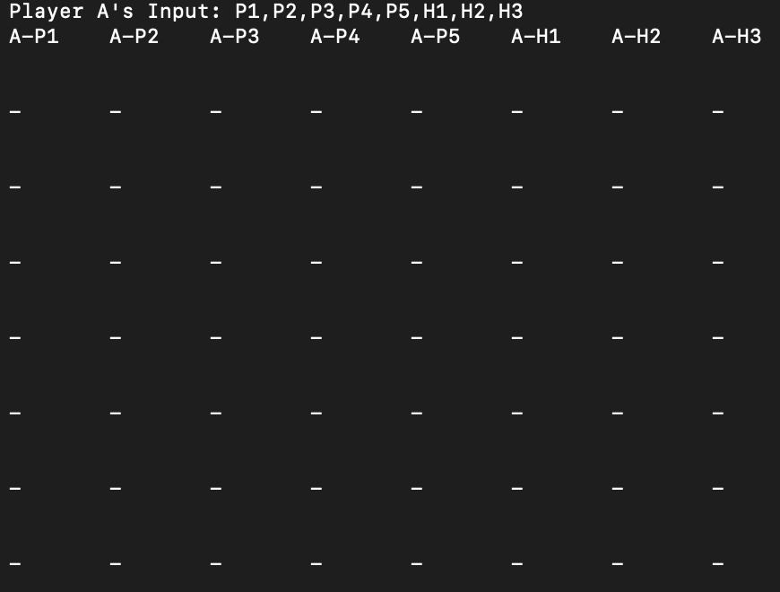

<div id="top"></div>

[![Forks][forks-shield]][forks-url]
[![Stargazers][stars-shield]][stars-url]
[![Issues][issues-shield]][issues-url]


<!-- PROJECT LOGO -->
<br />
<div align="center">

<h2 align="center">Node.js CLI Chess Game</h2>

  <p align="center">
    <br />
    <a href="https://github.com/srajandev98/nodejs-cli-chess-game">View Demo</a>
    ·
    <a href="https://github.com/srajandev98/nodejs-cli-chess-game/issues">Report Bug</a>
    ·
    <a href="https://github.com/srajandev98/nodejs-cli-chess-game/issues">Request Feature</a>
  </p>
</div>


<!-- ABOUT THE PROJECT -->
## About The Project

<div align="center">
    <br/>
    
    <br/>
    <br/>
</div>

This game can be played by 2 players, each player can have 8 characters (5 - Pawn, 1 - Rook, 1 - Bishop, 1 - Knight)

<p align="right">(<a href="#top">back to top</a>)</p>


### Built With

* [Node.js](https://nodejs.org/)
* [JavaScript](https://developer.mozilla.org/en-US/docs/Web/JavaScript)

<p align="right">(<a href="#top">back to top</a>)</p>


<!-- GETTING STARTED -->
## Getting Started

To get a local copy up and running follow these simple example steps.

### Prerequisites

* Install [Node.js](https://nodejs.org/en/download/) if you don't have already

### Installation

1. Clone the repo
   ```sh
   git clone https://github.com/srajandev98/nodejs-cli-chess-game.git
   ```
2. Install NPM packages
   ```sh
   npm install
   ```
2. Start the game
   ```sh
   npm start
   ```

<p align="right">(<a href="#top">back to top</a>)</p>


<!-- ROADMAP -->
## Roadmap

- [x] Add Pawn Character
- [x] Add Rook Character
- [x] Add Bishop Character
- [x] Add Knight Character

See the [open issues](https://github.com/srajandev98/nodejs-cli-chess-game/issues) for a full list of proposed features (and known issues).

<p align="right">(<a href="#top">back to top</a>)</p>


<!-- CONTRIBUTING -->
## Contributing

Contributions are what make the open source community such an amazing place to learn, inspire, and create. Any contributions you make are **greatly appreciated**.

If you have a suggestion that would make this better, please fork the repo and create a pull request. You can also simply open an issue with the tag "enhancement".
Don't forget to give the project a star! Thanks again!

1. Fork the Project
2. Create your Feature Branch (`git checkout -b feature/AmazingFeature`)
3. Commit your Changes (`git commit -m 'Add some AmazingFeature'`)
4. Push to the Branch (`git push origin feature/AmazingFeature`)
5. Open a Pull Request

<p align="right">(<a href="#top">back to top</a>)</p>


<!-- LICENSE -->
## License

Distributed under the MIT License. See `LICENSE` for more information.

<p align="right">(<a href="#top">back to top</a>)</p>


<!-- CONTACT -->
## Contact

Your Name - [@srajangupta__](https://twitter.com/srajangupta__) - srajaninnov@gmail.com

Project Link: [https://github.com/srajandev98/nodejs-cli-chess-game](https://github.com/srajandev98/nodejs-cli-chess-game)

<p align="right">(<a href="#top">back to top</a>)</p>


<!-- MARKDOWN LINKS & IMAGES -->
<!-- https://www.markdownguide.org/basic-syntax/#reference-style-links -->
[forks-shield]: https://img.shields.io/github/forks/srajandev98/nodejs-cli-chess-game.svg?style=for-the-badge
[forks-url]: https://github.com/srajandev98/nodejs-cli-chess-game/network/members
[stars-shield]: https://img.shields.io/github/stars/srajandev98/nodejs-cli-chess-game.svg?style=for-the-badge
[stars-url]: https://github.com/srajandev98/nodejs-cli-chess-game/stargazers
[issues-shield]: https://img.shields.io/github/issues/srajandev98/nodejs-cli-chess-game.svg?style=for-the-badge
[issues-url]: https://github.com/srajandev98/nodejs-cli-chess-game/issues
